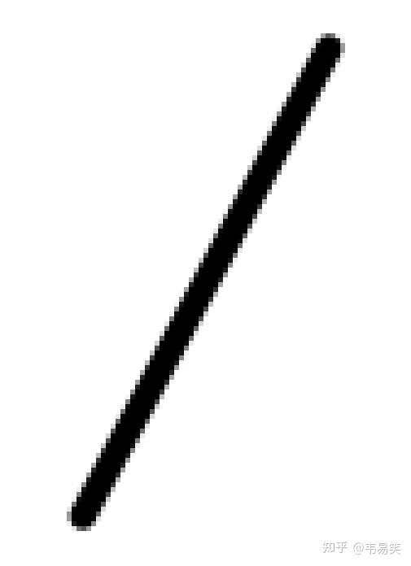

# a-line

## 背景

来源与知乎提问的回答：[想用 C++ 写一个小项目，有什么好的创意？](https://www.zhihu.com/question/275291023)

### 回答： [韦易笑](https://www.zhihu.com/question/275291023/answer/1994723085987882225)

用代码画一条直线：画图软件最基础的一件事情，画得出来你可以 piss off 99% 的客户端程序员要求很简单，正确绘制一条宽度为 5.25 长度位 52.5 的倾斜 30 度的一条直线，圆头抗锯齿，包括 CPU 方法和 GPU 方法两种实现，不依赖第三方库：

效果如上图。

PS：可以用 MSAA/SSAA，但不用的话加分（实际项目里做这个的确不会用）。
